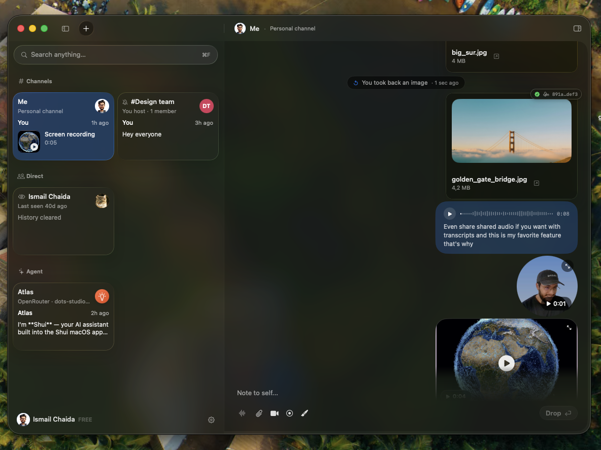
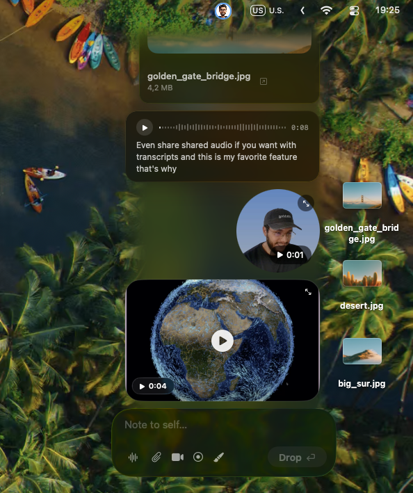

  

<h1 align="center">Shui</h1>

<strong>Your people. Right here.</strong> Private messaging for Mac that lives alongside your work.

  <a href="https://github.com/ichaida/shui-releases/releases/download/v1.0.0-rc.1/Shui.dmg"><strong>Download RC1</strong></a> ·
  <a href="https://shui.chaida.dev/">Website &amp; product tour</a> ·
  <a href="https://github.com/ichaida/shui-releases/releases/tag/v1.0.0-rc.1">Release notes</a>

1.0.0-rc.1 · Apple Silicon · macOS 26 or later

A file, a thought, a moment. Just a drop away. Shui keeps your conversations close, whether you're sharing with your people or leaving something for yourself.

## Alongside your work

- **Menubar Chat.** Click a face in your menu bar to open a conversation over your work. Drop a file, write a quick note, and keep going.
- **More than text.** Share voice notes with transcripts, video messages, screenshots and screen recordings. Voice transcription happens on your Mac.
- **Your own space.** Keep notes, files and recordings in your personal channel.
- **Your circle.** Create a channel and share its invitation, or join someone else's. Each participant needs Shui.
- **The bigger picture.** Open the main window to see your channels, people and optional AI agents. Choose Card or List layout.

See Menubar Chat

Screenshots show real app captures from a personal channel.

## Try the first release candidate

**RC1 is a prerelease for testing before Shui's first stable version.** Try the free build before purchasing Pro.

1. [Download Shui.dmg](https://github.com/ichaida/shui-releases/releases/download/v1.0.0-rc.1/Shui.dmg).
2. Open the disk image and drag **Shui** into **Applications**.
3. Open Shui, then create a channel or accept an invitation.

The app and disk image are Developer ID signed, notarized and stapled. This build requires **Apple Silicon and macOS 26 or later**; Intel Macs are not supported.

**Updating RC builds:** install newer release candidates manually from [Releases](https://github.com/ichaida/shui-releases/releases). RC1 is not distributed through the stable Sparkle update feed or Homebrew. Homebrew installation will become available with the first stable release.

## Private by design

Messages and files travel over end-to-end encrypted peer connections, direct when possible and through encrypted relays when needed. Your history and received files live on participating devices, without a Shui cloud inbox or cloud storage quota.

Your messaging identity is created on your Mac, with keys in your Keychain. No email address, phone number or iCloud sign-in is required for messaging.

Delivery depends on peers becoming reachable. Device security and network metadata still matter; back up your Mac to protect your local history. Optional AI agents have a separate data path: prompts sent to a remote provider follow that provider's privacy policy.

[Privacy, in plain words](https://shui.chaida.dev/privacy)

## Free to start. Room to grow.

Shui is free: join unlimited channels, host **one channel**, and keep your personal space. Notes, files, voice and video are included.

Want to host more? Pro unlocks unlimited new hosted channels on **up to 3 Macs per license**.

| | Pro Yearly | Pro Lifetime |
| --- | --- | --- |
| Pre-release price | **$19/year** | **$49 once** |
| Planned regular price | $39/year | $69 once |
| Billing | Renews yearly until cancelled | No recurring subscription |
| | [Choose Yearly](https://buy.polar.sh/polar_cl_ALMsu42TgBI2D7QYbp03wK5lbKqwWsoygbYkF1M6b0c) | [Choose Lifetime](https://buy.polar.sh/polar_cl_YGasYuuBxWkyoyYeLsgJrQdeE1licL3QnBkQH3oP4b9) |

Checkout and licensing are handled by Polar. Yearly allows new hosted channels while subscribed. Planned regular prices apply after pre-release.

## It's early. Help shape the next release.

I use Shui every day, and I'm still learning where it fits best. Tell me how you use it, what's missing, and what feels off. Ideas, bugs, awkward moments: they're all useful.

[Email me](mailto:shui@chaida.dev) or [report a bug](https://github.com/ichaida/shui-releases/issues). For bugs, include your macOS version, Shui version and steps to reproduce. Keep private conversations, credentials and files out of public reports.

Ismail, maker of Shui · [shui@chaida.dev](mailto:shui@chaida.dev)

---

This repository contains Shui's public downloads, release notes and distribution assets. Source code is maintained separately.
